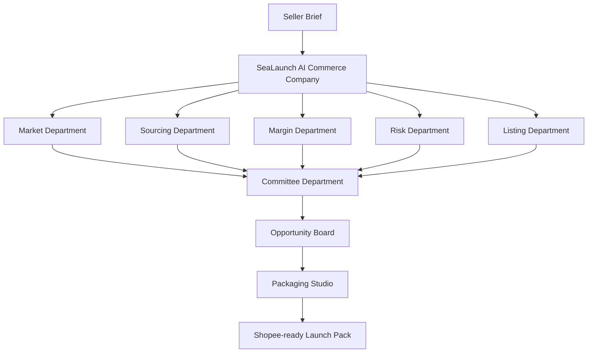

# SeaLaunch AI UI / Frontend Design

## 1. 产品基础信息

### 产品名

**SeaLaunch AI**

### Slogan

**Zero-person company. One AI commerce team. Endless product opportunities.**

### 前端定位

**SeaLaunch AI is an AI commerce company built for one Shopee seller.**

中文表达：

> SeaLaunch AI 是为一个 Shopee 卖家配置的一整套 AI 电商公司。

### 平台范围

全站只出现一个平台：

```text
Shopee only
```

---

## 2. 首页 Homepage

### 2.1 首屏 Hero

Homepage 首屏需要突出产品名和 slogan。

```text
SeaLaunch AI
Zero-person company. One AI commerce team. Endless product opportunities.

Launch Shopee-ready products with an AI commerce company built for one seller.
```

CTA：

```text
Build my AI commerce team
```

Secondary CTA：

```text
View Shopee launch pack
```

右侧视觉建议展示一个 Shopee 风格的产品工作台 preview：

- Platform：Shopee
- Market：Singapore
- Product：Mini desk vacuum
- AI Commerce Company Org Chart
- Department status
- Go / Watch / Reject
- Shopee-ready Launch Pack preview

### 2.2 首页痛点模块

标题：

```text
Selling on Shopee is not one task. It is a whole operating team.
```

| 用户痛点 | 首页文案 |
|---|---|
| 不知道卖什么 | Which products actually have market demand? |
| 不知道哪里找货 | Can we find stable and low-cost suppliers? |
| 不知道能不能赚钱 | Can this product make money after shipping, fees and returns? |
| 不知道有没有风险 | Is this product safe to sell under Shopee rules? |
| 不知道怎么上架 | How do we turn this into a Shopee product page? |
| 不知道怎么包装 | How do we make this product more attractive and higher-value? |

### 2.3 痛点对应 AI 部门

| 用户痛点 | AI 公司部门 | 前端展示 |
|---|---|---|
| 不知道卖什么 | Market Department | market heat、competitors、price band |
| 不知道哪里找货 | Sourcing Department | suppliers、stock、MOQ、fulfillment |
| 不知道能不能赚钱 | Margin Department | cost breakdown、net margin、scenario analysis |
| 不知道有没有风险 | Risk Department | risk badge、warnings、blocked reasons |
| 不知道怎么上架 | Listing Department | Shopee fields、title、description、SKU |
| 不知道怎么包装 | Packaging Studio | positioning、bundle、gift、visual direction |
| 不知道最后该不该做 | Committee Department | Go / Watch / Reject |

### 2.4 AI Commerce Company 组织图



### 2.5 首页流程模块

```text
Seller Brief → AI Commerce Company → Opportunity Board → Packaging Studio → Shopee-ready Launch Pack
```

---

## 3. 视觉风格与配色

### 3.1 主色体系

使用 Shopee 风格配色。

| 用途 | 建议颜色 |
|---|---|
| 主色 | Shopee Orange |
| CTA | Shopee Orange |
| 平台 badge | Shopee Orange |
| 背景 | Warm white / light cream |
| 卡片 | White / very light orange tint |
| 文字 | Charcoal / dark gray |
| 分割线 | Light gray / light orange border |

### 3.2 状态色

| 状态 | 展示方式 |
|---|---|
| Go | Green badge |
| Watch | Amber badge |
| Reject | Red badge |
| Human Review | Gray / orange warning badge |
| Running | Animated orange progress |
| Completed | Check badge |

### 3.3 整体风格

- Shopee orange-based。
- 浅色背景。
- 专业 SaaS dashboard 感。
- AI 公司组织图作为主视觉语言。
- Packaging Studio 作为视觉亮点。
- 页面不要过度复杂，但要有完整业务链路。

---

## 4. 公司部门制 Agent 架构

### 4.1 AI Commerce Company Org Chart

```text
Seller
  ↓
SeaLaunch AI Commerce Company
  ├── Market Department / Market Agent
  ├── Sourcing Department / Sourcing Agent
  ├── Margin Department / Margin Agent
  ├── Risk Department / Risk Agent
  ├── Listing Department / Listing Agent
  └── Committee Department / Committee Agent
  ↓
Opportunity Board
  ↓
Packaging Studio
  ↓
Shopee-ready Launch Pack
```

### 4.2 部门与 Agent 对应关系

| 公司部门 CN | Department EN | MVP Agent | 角色描述 | 前端回答的问题 |
|---|---|---|---|---|
| 市场洞察部 | Market Department | Market Agent | 判断市场热度、搜索趋势、竞品格局、价格带与平台机会 | 这个品有没有市场需求 |
| 货源采购部 | Sourcing Department | Sourcing Agent | 寻找可用货源，判断供应商、库存、MOQ、履约稳定性与拿货可行性 | 这个品能不能找到稳定供应 |
| 利润测算部 | Margin Department | Margin Agent | 计算真实利润，包括售价、成本、平台费用、物流费用、广告空间与低 / 中 / 高情景利润 | 这个品能不能赚钱 |
| 风险合规部 | Risk Department | Risk Agent | 判断平台规则、合规风险、侵权风险、夸大宣传、电池 / 电子安全等问题 | 这个品能不能安全地卖 |
| 商品上架部 | Listing Department | Listing Agent | 生成商品标题、卖点、关键词、图片 prompt、详情页结构与 Shopee 字段 | 这个品怎么被包装成 Shopee 商品页 |
| 投审委员会 | Committee Department | Committee Agent | 汇总所有 Agent 判断，处理部门冲突，综合市场、利润、风险和履约结果 | 是否 Go / Watch / Reject |
| 包装增长工作室 | Packaging Studio | Studio after selection | 设计包装方案、套装组合、赠品策略、差异化卖点与视觉表达 | 这个品怎么卖得更贵、更有吸引力 |

### 4.3 Packaging Studio 位置

Packaging Studio 不作为前置 Agent 平铺在 Agent 工作区里。

它在用户从 Opportunity Board 选择商品之后出现，负责把商品包装成更适合 Shopee Singapore 的商品页。

---

## 5. 页面信息架构

| 页面 | 页面名称 | 核心作用 |
|---|---|---|
| 1 | Homepage | 展示 slogan、痛点、AI 公司组织图、Shopee-ready 链路 |
| 2 | Login / Entry Page | 登录、开始体验、进入工作台 |
| 3 | Seller Brief Page | 输入市场、预算、商品方向、风险偏好；平台固定 Shopee |
| 4 | Product Signal Upload Page | 上传商品图片、链接、关键词、供应商报价 |
| 5 | AI Commerce Org Room | 组织图式 Agent 工作区，展示公司部门状态 |
| 6 | Department Output Detail | 查看单个部门的 evidence、score、output preview |
| 7 | Committee Review Page | 汇总部门冲突，输出 Go / Watch / Reject |
| 8 | Opportunity Board | 展示 3-5 个 Shopee 商品机会，用户选择商品 |
| 9 | Packaging Studio | 用户 select 后进入，左侧 tabs，右侧 visual canvas |
| 10 | Shopee Listing Studio | 生成 Shopee listing package、标题、描述、SKU、价格和字段 |
| 11 | ROI / Check Dashboard | 展示机会数量、Launch Pack、风险拦截和运行记录 |

---

## 6. Seller Brief Page

### 页面目标

让用户用 1-2 分钟输入自己的 Shopee 生意目标，触发 AI 公司开始工作。

### 页面字段

| 模块 | 字段 | 控件 | 示例 |
|---|---|---|---|
| Market | target_market | 单选 / 多选 | Singapore |
| Platform | target_platform | 固定 badge | Shopee |
| Seller Type | user_type | 单选 | Solo seller / Dropshipper / Small merchant / Factory seller |
| Product Mode | product_mode | 单选 | I have a product / I know a category / Recommend for me |
| Category | category | 多选 | Home appliance / Pet supplies / Storage / Electronics accessories |
| Keywords | user_keywords | 输入框 | mini desk vacuum |
| Budget | budget_range | slider / input | SGD 500 - 3000 |
| Margin Target | expected_margin | 单选 / slider | 20% / 30% / 50% |
| Fulfillment | max_fulfillment_days | dropdown | 7 / 14 / 21 days |
| Risk | risk_preference | segmented control | Conservative / Balanced / High-profit high-risk |
| Language | language_preference | 单选 | English / Chinese / Bilingual |

### 页面 CTA

```text
Start AI Company Run
```

辅助按钮：

```text
Use demo brief: Mini desk vacuum in Singapore
```

---

## 7. Product Signal Upload Page

### 页面目标

允许用户提供更多商品线索，让 AI 部门基于用户已有信息进行分析。

### 输入类型

| 输入类型 | 说明 |
|---|---|
| Product image | 商品图片、货源图、竞品图 |
| Product link | Shopee 商品链接或货源链接 |
| Keyword | 商品关键词 |
| Supplier quote | 供应商报价 |
| Product specs | 尺寸、重量、颜色、功能、包装内容 |
| Existing price | 用户已有价格信息 |

### 页面布局

| 区域 | 内容 |
|---|---|
| 左侧上传区 | 图片、链接、关键词、报价、规格 |
| 右侧解析区 | 商品名称猜测、类目猜测、可见属性、可能规格、待补充字段 |

---

## 8. AI Commerce Org Room

### 页面目标

把 Agent 工作过程呈现为 AI 公司部门协作，而不是普通 loading 或聊天流。

### 页面布局

| 区域 | 内容 |
|---|---|
| 左侧 | AI 公司组织图：Market / Sourcing / Margin / Risk / Listing / Committee |
| 中间 | Department Output Stream：每个部门的关键输出摘要 |
| 右侧 | Evidence Drawer：被选中部门的证据、评分、假设和输出 |

### 部门状态

| 状态 | 含义 |
|---|---|
| Waiting | 等待执行 |
| Running | 正在分析 |
| Completed | 已完成 |
| Blocked | 被硬性问题阻断 |
| Human Review Required | 需要人工确认 |

### Department Card 通用结构

```text
[Department Name]
Agent: [Agent Name]
Question: [This department answers what?]
Status: Running / Completed / Blocked
Key Finding: [One sentence result]
Score: [0-100 or badge]
Evidence: [3 short bullets]
Output Preview: [structured preview]
```

---

## 9. Department Cards

### 9.1 Market Department

回答：

```text
这个品有没有市场需求？
```

展示字段：

- market_heat
- competitor_density
- price_band
- review_density
- demand_signal_score
- trend_source_links

示例：

```text
Market Department
Agent: Market Agent
Key Finding: Mini desk vacuum has visible demand in Shopee Singapore office and student desk scenarios.
Output Preview:
- Market heat: Medium-high
- Competitor density: Medium
- Price band: SGD 8.90 - 19.90
```

### 9.2 Sourcing Department

回答：

```text
这个品能不能找到稳定供应？
```

展示字段：

- supplier_candidates
- source_price
- available_stock
- MOQ
- estimated_fulfillment_time
- supplier_reliability_score
- sourcing_risk

### 9.3 Margin Department

回答：

```text
这个品能不能赚钱？
```

展示字段：

- source_price
- suggested_selling_price
- international_shipping_cost
- platform_fee
- payment_fee
- tax_or_gst_estimate
- return_loss_reserve
- packaging_cost
- ai_operation_cost
- gross_margin
- net_margin
- low / base / high scenario

### 9.4 Risk Department

回答：

```text
这个品能不能安全地卖？
```

检查项：

- 平台规则风险
- 侵权风险
- 夸大宣传风险
- 电池 / 电子安全风险
- 图片与实物不一致风险
- 履约风险
- keyword spam
- price spam

展示字段：

- risk_score
- risk_level
- violation_flags
- compliance_recommendations
- blocked_reasons
- required_human_review

### 9.5 Listing Department

回答：

```text
这个品怎么变成 Shopee 商品页？
```

展示字段：

- item_name
- category_id
- brand
- condition
- description
- price
- stock
- sku
- variation
- attributes
- logistics
- package_weight
- package_dimensions
- images
- compliance_notes

### 9.6 Committee Department

回答：

```text
综合来看，这个品应该 Go / Watch / Reject？
```

展示字段：

- ranked_opportunities
- decision
- decision_reason
- tradeoff_summary
- recommended_next_action
- confidence_score

---

## 10. Department Output Detail Page

### 页面目标

用户点击某个部门后，可以查看该部门更详细的判断、证据和输出。

### 页面结构

| 区域 | 内容 |
|---|---|
| 左侧 | Department list |
| 中间 | Department result |
| 右侧 | Evidence and assumptions |

### 内容结构

- Department mission
- Input used
- Evidence found
- Key calculation / reasoning
- Output fields
- Confidence score
- Warning / blockers
- Impact on Committee decision

---

## 11. Committee Review Page

### 页面目标

展示不同部门之间的冲突，并由 Committee Department 给出最终判断。

### 综合决策卡

```text
Decision: Go / Watch / Reject
Confidence: 82%
Recommended next action: Select for Packaging Studio
```

### 部门分数矩阵

| Department | Score | Status | Key Finding |
|---|---:|---|---|
| Market | 82 | Positive | Demand visible |
| Sourcing | 76 | Positive | Suppliers available |
| Margin | 78 | Positive | Base margin works |
| Risk | 63 | Warning | Avoid exaggerated claims |
| Listing | 80 | Ready | Shopee fields can be generated |

### 冲突解释

| 冲突场景 | 前端展示 |
|---|---|
| 高热度 + 低利润 | Watch，建议寻找更低货源或差异化包装 |
| 高利润 + 高风险 | Reject 或 Human Review |
| 低价货源 + 长履约 | Watch，要求更换供应商或调整发货承诺 |
| 字段完整 + 合规 warning | Human Review，不直接通过 |
| 中等利润 + 低风险 + 稳定货源 | Go |

### 推荐权重

| 维度 | 权重 |
|---|---:|
| Profit viability | 30% |
| Market demand | 25% |
| Compliance risk | 20% |
| Fulfillment feasibility | 15% |
| Listing readiness | 10% |

---

## 12. Opportunity Board

### 页面目标

展示 3-5 个 Shopee 商品机会，让用户选择一个进入 Packaging Studio。

### 页面结构

上方 summary：

- Opportunities found
- Go count
- Watch count
- Reject count
- Average estimated margin
- Risk warnings

下方商品机会卡片。

### Opportunity Card 字段

| 字段 | 含义 |
|---|---|
| product_name | 商品名称 |
| product_direction | 商品方向 |
| target_platform | Shopee |
| target_market | Singapore |
| source_price | 货源参考价 |
| suggested_selling_price | 建议售价 |
| gross_margin | 预计毛利 |
| net_profit | 预计净利润 |
| net_margin | 预计净利润率 |
| available_stock | 库存状态 |
| fulfillment_time | 履约周期 |
| market_heat | 市场热度 |
| risk_level | 风险等级 |
| confidence_score | 置信度 |
| decision | Go / Watch / Reject |
| key_reason | 关键推荐理由 |

### 卡片操作

- View department outputs
- View evidence
- Compare
- Select for Packaging Studio
- Reject
- Adjust assumptions

### Demo 商品候选

| 商品方向 | 决策展示 | 说明 |
|---|---|---|
| Mini desk vacuum | Go | 场景直观、图片展示好、风险相对可控 |
| Portable dehumidifier | Watch | 新加坡潮湿场景强，但电器安全和售后风险更高 |
| Cable organizer | Go / Watch | 风险低、轻量，但利润空间可能较低 |
| Pet grooming tool | Watch | 视觉好，但需规避医疗功效表达 |
| Compact garment steamer | Watch / Human Review | 场景清晰，但电器安全和漏水风险更高 |

---

## 13. Packaging Studio

### 页面目标

Packaging Studio 是用户 select 商品之后进入的后置工作台。

它负责把已经通过初步验证的商品，包装成更适合 Shopee Singapore、更有差异化、更有售价空间的商品页。

### 页面布局

```text
Packaging Studio

Left Sidebar:
- Product Brief
- Shopee Title
- Selling Points
- Positioning
- Bundle Strategy
- Gift Strategy
- Image Prompt
- Main Image
- Lifestyle Image
- Feature Image
- Listing Preview
- Compliance Notes

Right Canvas:
- ChatGPT-rendered visual output
- Image preview
- Listing preview
- Packaging mockup
- Generated copy
- Editable fields
```

### 左侧 Tabs

| Tab | 作用 |
|---|---|
| Product Brief | 展示商品基础信息、市场、成本和风险摘要 |
| Shopee Title | 生成本地化 Shopee 标题 |
| Selling Points | 生成卖点排序和 bullet points |
| Positioning | 设计商品定位和差异化表达 |
| Bundle Strategy | 设计套装组合，提高客单价 |
| Gift Strategy | 设计赠品策略，提高吸引力 |
| Image Prompt | 生成主图、场景图、卖点图 prompt |
| Main Image | 展示主图方向和生成结果 |
| Lifestyle Image | 展示生活方式场景图 |
| Feature Image | 展示功能卖点图 |
| Listing Preview | 展示 Shopee 商品页预览 |
| Compliance Notes | 展示图片、文案、卖点的风险备注 |

### 右侧 Visual Canvas

右侧展示：

- 商品主图。
- 生活方式图。
- 卖点图。
- 商品标题预览。
- Shopee 商品详情页 preview。
- 包装风格说明。
- 套装 / 赠品策略。
- 价格提升逻辑。
- 可编辑字段。

### Packaging Studio Output

| 输出 | 说明 |
|---|---|
| localized_shopee_title | 本地化 Shopee 标题 |
| selling_points | 卖点排序 |
| product_description | 商品描述 |
| positioning_angle | 差异化定位 |
| bundle_strategy | 套装组合 |
| gift_strategy | 赠品策略 |
| image_prompts | 图片生成 prompt |
| hero_image_direction | 主图方向 |
| lifestyle_image_direction | 生活方式图方向 |
| feature_image_direction | 卖点图方向 |
| generated_image_candidates | 生成图片候选 |
| visual_preview | 右侧渲染预览 |
| compliance_notes | 合规备注 |
| price_uplift_reasoning | 提升售价空间的逻辑 |

### Mini Desk Vacuum Packaging 示例

商品：Mini desk vacuum  
目标市场：Singapore  
平台：Shopee

包装方向：

```text
Compact desk cleaning for HDB home office, student dorm and small workspaces.
```

可展示的包装策略：

- 主图：干净桌面 + 小型吸尘器 + 键盘碎屑清理场景。
- 生活方式图：HDB home office / student dorm。
- 卖点图：portable、USB rechargeable、keyboard cleaning、compact storage。
- 套装策略：desk vacuum + cleaning brush + small storage pouch。
- 赠品策略：free mini brush / replacement nozzle。
- 提价逻辑：从单品清洁工具包装成 desk cleaning kit。

---

## 14. Shopee Listing Studio

### 页面目标

把 Packaging Studio 的结果转化成完整的 Shopee listing package。

### 页面模块

| 模块 | 内容 |
|---|---|
| Listing Fields | 标题、描述、类目、品牌、属性 |
| Pricing & Inventory | 价格、库存、SKU、variation |
| Logistics | 重量、尺寸、履约方式 |
| Images | 主图、场景图、卖点图 |
| Compliance Checklist | 风险检查 |
| JSON / CSV Preview | 可复制和导出字段 |

### Shopee Listing Fields

| 字段 | 说明 |
|---|---|
| item_name | Shopee 商品标题 |
| category_id | 商品类目 |
| brand | 品牌 |
| condition | 商品状态 |
| description | 商品描述 |
| price | 价格 |
| stock | 库存 |
| sku | SKU |
| variation | 规格 / variation |
| attributes | 类目属性 |
| logistics | 物流配置 |
| package_weight | 包裹重量 |
| package_dimensions | 包裹尺寸 |
| images | 商品图片 |
| compliance_notes | 合规备注 |

### 页面操作

- Edit field
- Regenerate field
- Copy field
- Copy JSON
- Export CSV
- Send to Review
- Mark as Approved
- Download Launch Pack

### Listing Preview

右侧展示接近 Shopee 商品页的 preview：

- 商品主图
- 标题
- 价格
- 评分占位
- 卖点
- 商品描述
- SKU / variation
- 物流信息
- 风险提示

---

## 15. ROI / Check Dashboard

### 页面目标

展示整个 AI 公司工作流产生的结果，包括机会数量、上架包数量、风险拦截、运行记录和可复用资产。

### Dashboard 模块

| 模块 | 内容 |
|---|---|
| Opportunity Summary | 找到多少商品机会、Go / Watch / Reject 数量 |
| Launch Pack Summary | 生成多少 Shopee-ready Launch Pack |
| Risk Summary | 哪些风险被拦截、哪些需要人工 review |
| Workflow Summary | 每个部门完成情况和运行时间 |
| Packaging Assets | 生成了哪些标题、图片 prompt、图像、套装策略 |
| Export History | 已导出的 JSON / CSV / Launch Pack |
| Reusable Templates | 可复用 listing template、image prompt、packaging skill |

### 核心指标

- opportunities_found
- go_count
- watch_count
- reject_count
- launch_pack_generated
- risk_blocked_count
- human_review_required_count
- estimated_margin_range
- reusable_template_count
- exported_pack_count
