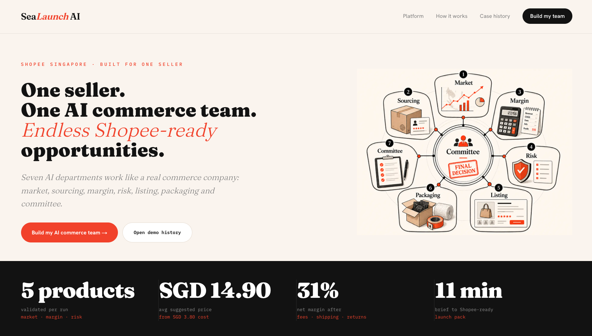
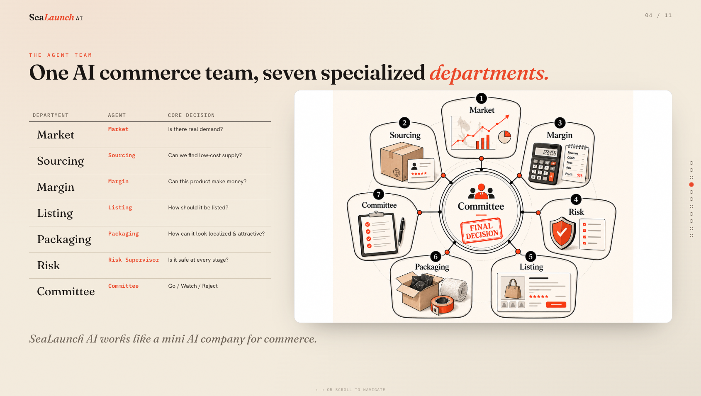
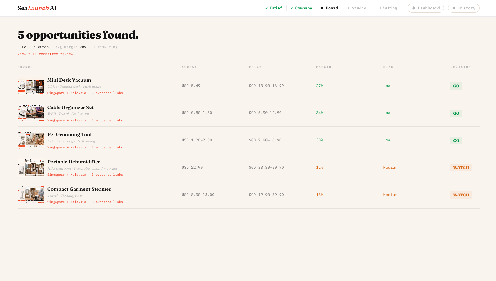
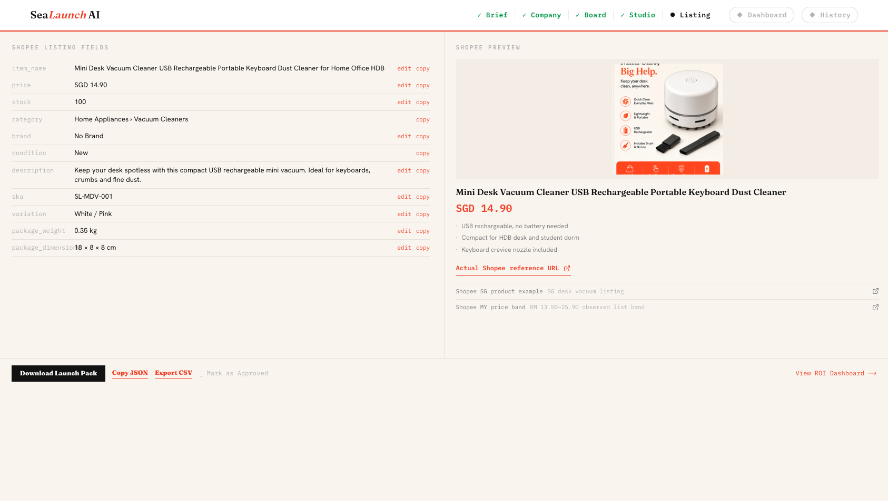
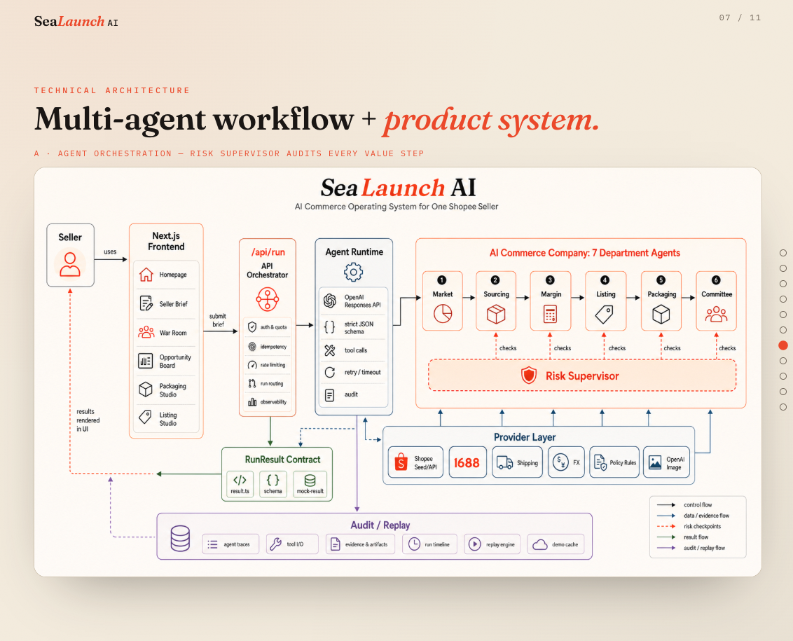

# SeaLaunch AI

[English](#english) · [中文](#中文)

<a id="english"></a>

**Built at the [Sea × OpenAI Regional Codex Hackathon — Singapore](https://luma.com/kv0kks2a?locale=en-GB) — 319 teams applied, with 40 team slots available.**

SeaLaunch turns one Shopee seller into an AI commerce team. Seven specialized agents work from a seller brief to evaluate product opportunities, model unit economics, check risk, shape packaging, and produce a Shopee-ready launch pack.

[Live product demo](https://codexhackathon-sealaunch.vercel.app/) · [Hackathon pitch](https://sealaunch-pitch.vercel.app/)

> The current demo uses transparent mock/static data from `src/lib/mock-data.ts`, shaped to match a future backend. The featured case is a Mini Desk Vacuum for Singapore.

## Product walkthrough

### One seller, one AI commerce team



### Seven specialized departments

Market, Sourcing, Margin, Risk, Listing, Packaging, and Committee agents each own a specific commerce decision, then contribute to one final recommendation.



### Ranked opportunities with real unit economics



### A Shopee-ready launch pack



## Technical architecture

The current repository is a frontend demo backed by transparent mock/static data. The diagram below describes the target production architecture: an orchestrated agent runtime, department-level responsibilities, risk checkpoints, provider integrations, and an auditable run-result contract.



## Product flow

`Seller brief` → `AI company` → `Opportunity board` → `Packaging studio` → `Shopee listing`

- `/app/brief` — capture the seller's market, category, and operating constraints
- `/app/org-room` — watch seven AI departments analyze the brief
- `/app/board` — compare ranked opportunities, margins, and risk signals
- `/app/studio` — turn the selected opportunity into a packaging concept
- `/app/listing` — generate the final Shopee-ready launch pack
- `/app/history`, `/app/dashboard`, and `/app/org-room/[dept]` — inspect previous cases, metrics, and department-level evidence

## Stack

Next.js App Router · TypeScript · Tailwind CSS v4 · shadcn/ui · Framer Motion · Zustand · Vitest

## Run locally

```bash
npm install
npm run dev      # http://localhost:3000
npm test         # store, flow, and mock-data unit tests
npm run build    # production build
```

See [`docs/superpowers/specs/2026-06-06-sealaunch-ai-website-design.md`](docs/superpowers/specs/2026-06-06-sealaunch-ai-website-design.md) for the design specification.

---

<a id="中文"></a>

## 中文

**诞生于 [Sea × OpenAI Regional Codex Hackathon — Singapore](https://luma.com/kv0kks2a?locale=en-GB)：319 支团队报名，仅开放 40 个参赛席位。**

SeaLaunch 将一名 Shopee 卖家变成一支 AI 电商团队。七个专业智能体从卖家需求简报出发，评估产品机会、测算单位经济模型、检查风险、设计包装，并产出可直接用于 Shopee 上架的发布方案。

[在线产品演示](https://codexhackathon-sealaunch.vercel.app/) · [黑客松路演](https://sealaunch-pitch.vercel.app/)

> 当前演示使用来自 `src/lib/mock-data.ts` 的透明模拟/静态数据，其结构与未来后端保持一致。展示案例是面向新加坡市场的迷你桌面吸尘器。

## 产品演示

### 一名卖家，一支 AI 电商团队


### 七个专业部门

市场、采购、利润、风险、商品详情、包装和决策委员会智能体分别负责一项具体的电商决策，最终共同形成一项完整建议。


### 结合真实单位经济模型的机会排序


### 可直接用于 Shopee 的发布方案


## 技术架构

当前仓库是一个由透明模拟/静态数据支持的前端演示。下图展示目标生产架构：由编排层管理的智能体运行时、各部门职责、风险检查点、服务提供方集成，以及可审计的运行结果契约。


## 产品流程

`卖家需求简报` → `AI 公司` → `机会看板` → `包装工作室` → `Shopee 商品详情`

- `/app/brief` — 收集卖家的市场、品类和运营限制
- `/app/org-room` — 查看七个 AI 部门分析需求简报
- `/app/board` — 对比经过排序的机会、利润和风险信号
- `/app/studio` — 将选定机会转化为包装概念
- `/app/listing` — 生成最终可用于 Shopee 的发布方案
- `/app/history`、`/app/dashboard` 和 `/app/org-room/[dept]` — 查看历史案例、指标和部门级证据

## 技术栈

Next.js App Router · TypeScript · Tailwind CSS v4 · shadcn/ui · Framer Motion · Zustand · Vitest

## 本地运行

```bash
npm install
npm run dev      # http://localhost:3000
npm test         # store, flow, and mock-data unit tests
npm run build    # production build
```

设计规范请参阅 [`docs/superpowers/specs/2026-06-06-sealaunch-ai-website-design.md`](docs/superpowers/specs/2026-06-06-sealaunch-ai-website-design.md)。
